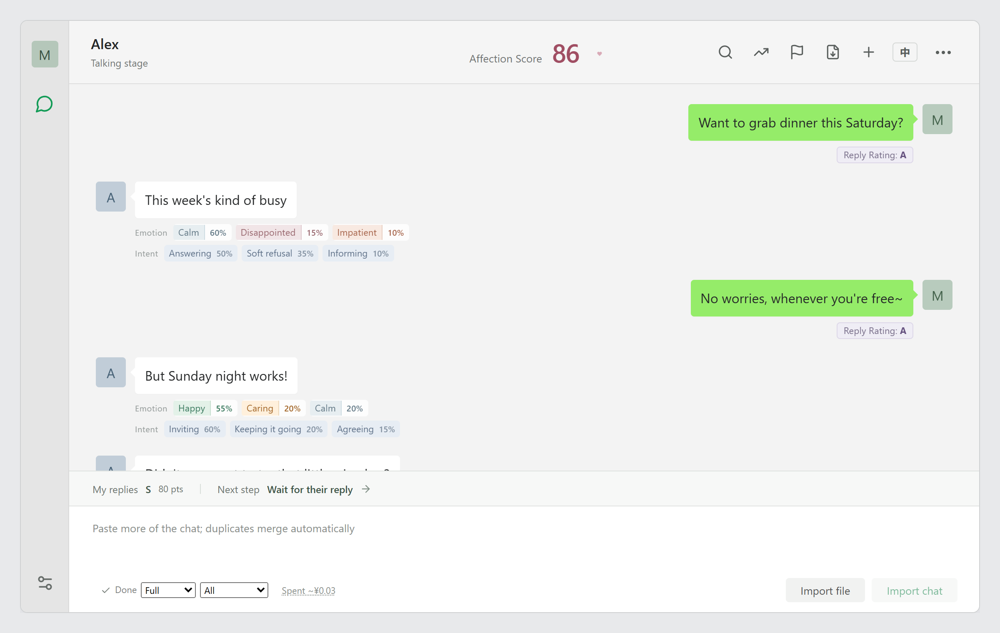

# Crush Monitor (Universal edition)

[简体中文](README.md) · English

> **About this version:** an adaptation of [Crush Monitor](https://github.com/FerryCorleone/crush-monitor) by [**FerryCorleone**](https://github.com/FerryCorleone). The original uses TypeSafe's Jev model; because TypeSafe paused new sign-ups, this version calls DeepSeek / OpenAI-compatible APIs by default, can still switch back to Jev (via OpenRouter, Vercel or TypeSafe) in the settings, and adds a number of improvements. Published with the original author's permission; it keeps the original MIT license and copyright notice ([LICENSE](LICENSE)).

A tool for looking at conversations with your crush or partner. It helps you make sense of emotions and intentions, and spot replies you could have worded better.

AI doesn't know your relationship or what happens outside the chat. Take the results lightly—as another perspective. Your own judgment and an honest conversation still matter more.



## Features

- **WeChat-style conversation view:** analysis sits beneath each message.
- **Emotions and intentions:** the top three probabilities from 12 emotion and 36 intention categories (including academic discussion).
- **Affection score and reply grades:** a conversation-level score, SSS–D grades for your replies, and suggested next steps.
- **Reasons you can read:** every label and score comes with a one-line, context-based explanation from the model, plus an overall reading.
- **Relationship trend:** a weekly affection curve with turning points marked.
- **Key moments:** invitations, care, confessions, refusals and similar events in one timeline; click to jump to the message.
- **Reply suggestions:** ask for two better ways to phrase any of your own replies.
- **Report export:** download a one-page HTML report.
- **Timing and quotes:** reply gaps, late-night chats and WeChat quoted replies are understood; images, stickers, recalls and pats are shown as context only.
- **Ten relationship types:** from "just met" to "cold war" and "exes", each with its own reading guidance.
- **Two model choices:** DeepSeek / OpenAI by default, or the original Jev (via OpenRouter, Vercel or TypeSafe); keys and prices are kept separately for each.
- **Your own key, cost shown:** runs locally with your own API credits and shows the estimated spend.
- **Privacy masking:** phone numbers, emails, ID and card numbers, and words you choose are replaced with placeholders before sending.
- **Analysis levels:** "Quick" reads only the overall score and trend (usually under ¥1), "Standard" adds emotions and intentions for each of their messages, "Full" also grades your replies; you can also analyze just the last 7 or 30 days.
- **Spending under control:** after importing you see the estimated cost and start manually; set a per-run limit that pauses the analysis; spent / estimated and time left are shown while it runs.
- **Correct a judgment:** if a line was read wrong, write what actually happened and the model re-reads that line with your note; later re-runs keep it.
- **Search and filters:** search the chat by keyword, or jump between "my low-scoring replies", "their negative emotions" and more.
- **English or Chinese interface:** switch with the **EN / 中** button at the top right (or in Chat Settings); it applies instantly and is remembered. The first visit follows your browser's language.

In English mode everything is in English, including what the model writes: its reasoning, overall reading and weekly summaries. Reply suggestions are always written in the same language as your original message, so English chats get English rewrites. The sample chat is in English too. Results already analyzed keep the language they were written in; after switching, the status bar offers to re-run them in the new language.

## Model

This version calls an OpenAI-compatible Chat Completions API (DeepSeek by default). `server/llm.ts` asks the model to write a reason and then a probability distribution for each question, and converts that into the same choices, scores and confidences the original used, so the rules layer is largely unchanged. General chat models are not calibrated the way Jev is, so results may be less precise than the original.

- [Get a DeepSeek API key](https://platform.deepseek.com/api_keys)
- OpenAI or other compatible services work too: change the address and model in the settings page.

**You can still use the original Jev model:** in the settings page, switch to **Jev (original model)**, pick a platform ([OpenRouter](https://openrouter.ai/settings/keys), Vercel AI Gateway or TypeSafe) and paste that platform's key. Jev returns calibrated probabilities but no written reasons. Choose **Jev only** (no reply suggestions) or **Jev + DeepSeek / OpenAI** (Jev analyzes, the chat model writes reply suggestions). Jev reads at most 500 messages / 12,000 characters per request; longer chats are sent in batches automatically, and the status bar shows which messages are being analyzed. Each service keeps its own key, so you can switch back and forth.

## Run locally

Install Node.js 22.12+. Download or clone this repository, then in the project directory:

```sh
npm ci
npm run setup
npm run build
npm start
```

Open [http://127.0.0.1:3178/](http://127.0.0.1:3178/), click the settings icon at the bottom left, paste your API key under **Model & API**, then **Save & test connection**. Leave the terminal running. On Windows you can also double-click `启动.bat`.

## Usage

1. Paste a conversation, or click **Import file** to pick a `.txt` export. Export-tool summary headers are skipped automatically.
2. Select your own name, check the estimated cost at the bottom, and click **Start Analysis**. Relationship type and background are in **Chat Settings**.
3. Click a label for details and the model's reasons. The three buttons at the top right are trend, key moments and report export.
4. Import more of the same conversation later: overlaps are merged and only new messages are analyzed.

### Supported text formats

| Source                | What to paste                                                                                                  |
| --------------------- | -------------------------------------------------------------------------------------------------------------- |
| WeChat                | Desktop multi-message copy (name, date/time, body on separate lines), or export-tool "name time" + body format |
| QQ                    | `Name: 09-17 19:26:53`, followed by the body on the next line; dates with a year also work                     |
| WhatsApp              | [Export a chat](https://faq.whatsapp.com/1180414079177245/), open the `.txt` file and copy its contents        |
| iMessage / other apps | Format each message as `Name: body`                                                                            |

```text
[9/17/26, 7:26:53 PM] Alex: Dinner tonight?
17/09/2026, 19:27 - Me: Sounds good
```

If a copied iMessage (or other) chat has only the text with no sender, add `Alex:` / `Me:` first; the app doesn't guess who said what.

Only two-person text conversations are supported—not images, audio, ZIP/HTML exports or chat databases. Placeholders such as `[Image]` or `<Media omitted>` are sent as context but not scored. WeChat recalls and nudges ("pats") are shown centered as system notices.

## Notes

- The affection score combines six weighted dimensions. An explicit refusal that still applies limits the score. **It is not the probability that someone likes you.**
- With DeepSeek / OpenAI, each model request holds up to 2,000 messages / 60,000 characters and 9 requests run at once. The overview reads the most recent ~1,950 messages; per-line analysis sees the previous 150 and next 20. With Jev, the original limits apply: 500 messages / 12,000 characters, previous 80 messages, 2 requests at once. The page says so when the overview can't read the whole chat. Total history is limited only by browser storage.
- Costs are shown in Chinese yuan (¥), because the default prices are DeepSeek's. For a service billed in US dollars, enter its prices converted to yuan in the settings; after a few runs you can type in your actual bill to calibrate the estimates. Your provider's bill is what counts.
- Jev writes no reasons; reply suggestions need **Jev + DeepSeek / OpenAI** mode. DeepSeek / OpenAI and Jev each keep their own prices and bill calibration; Jev estimates are approximate.
- After switching models, lines already analyzed keep their results; new lines and the overview use the new model. Model settings can't be saved while an analysis is running.
- Model replies are cached in `.cache/` so re-analyzing the same content is free; you can clear or disable this in settings. The cache contains chat text—never commit it.
- Chats and results stay in this browser's local database. Text needed for analysis (after masking) is sent to your configured model service, billed to your account.
- Never commit `.env`, `.cache/` or private conversations.

## Changelog

See [CHANGELOG.md](CHANGELOG.md) (in Chinese; releases from v2.4.0 end with an English summary). Current version v2.4.0: polish for English use (plurals, number formats, translated system notices) and a re-run offer after switching language.

## Development

React + TypeScript + Vite + Express, calling models through an OpenAI-compatible Chat Completions API or Jev's native API.

```sh
npm run dev        # http://127.0.0.1:5178/
npm test           # local tests; no model calls
npm run test:e2e   # UI tests in Edge with local stand-ins for DeepSeek and Jev; free
npm run check:live # real model check with the model chosen in .env; uses your API credits
npm run release    # tag and publish the version in package.json (needs a matching CHANGELOG section)
```

Interface text lives in `src/locales/zh.ts` and `src/locales/en.ts`. The English file's type is derived from the Chinese one, so a missing or extra key fails the build.

## License

[MIT](LICENSE). Copyright of the original project belongs to its author. Not affiliated with WeChat, Tencent, TypeSafe, DeepSeek, OpenAI, OpenRouter, Vercel or any messaging platform mentioned here.
